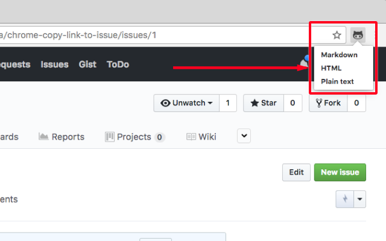

# chrome-copy-link-to-issue

Google Chrome extension for copying a link to the GitHub issue as Markdown/HTML etc.

## Download

You can install it through the [Chrome web store](https://chrome.google.com/webstore/detail/copy-the-link-to-github-i/cnnomdadchddnfpalaaoniehedbffnpp)

## Features

- Copy as ...
 - Markdown: `[#number｜title](url)`
 - HTML: `<a href="url">#number｜title</a>`
 - Plain text: `#number｜title url`
